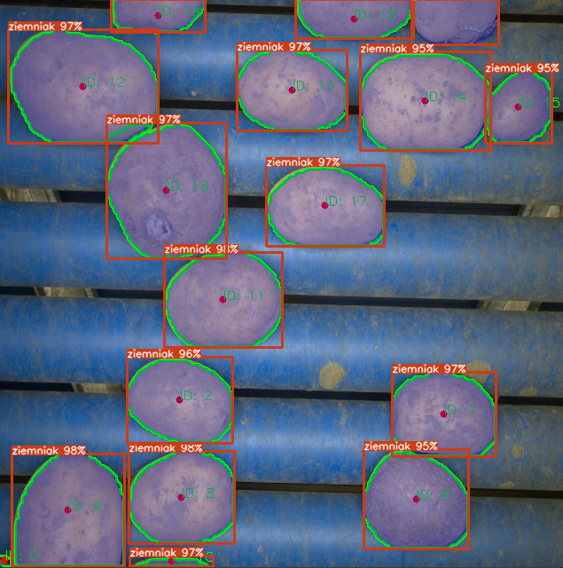

# PotatoSegmentation

Projekt do detekcji i segmentacji ziemniaków w wideo z użyciem OpenVINO (YOLO).  
Śledzi ziemniaki, kategoryzuje je na Small/Large i zapisuje obrazki z maskami.  

## Wymagania
- Python 3.8+ (zalecany 3.10+)  
- Git  
- Modele OpenVINO (`best.xml`, `best.bin`) w katalogu `assets/models/`  
- Pliki wideo (np. `demo.mp4`) w katalogu `assets/videos/`  

## Pipeline
```
Video → YOLO (OpenVINO) → Segmentacja → Kategoryzacja (Small/Large) → Zapis wyników
```

## Instalacja

1. Sklonuj repozytorium:
   ```bash
   git clone https://github.com/Nygus193Pro/Potato_Segmentation.git
   cd PotatoSegmentation
   ```

2. Utwórz i aktywuj środowisko wirtualne:
   ```bash
   python -m venv venv
   ```

### Windows
```bash
venv\Scripts\activate
```

### Linux/macOS
```bash
source venv/bin/activate
```

3. Zainstaluj zależności:
   ```bash
   pip install -r requirements.txt
   ```

4. Uruchom aplikację:
   ```bash
   python start_processing.py
   ```

## Działanie
Po uruchomieniu otworzy się okno 640x640 z wynikami detekcji:  
- zielone kontury → maski segmentacji,  
- czerwone centroidy,  
- ID obiektów.  

### Przykład działania
<p align="center">
  
</p>

Naciśnij `q`, aby zakończyć działanie programu.  
Wyniki są zapisywane w katalogach:  
- `Small/`, `Large/` (przetworzone obrazy),  
- `Small_raw/`, `Large_raw/` (obrazy surowe).  

## Licencja
MIT License
